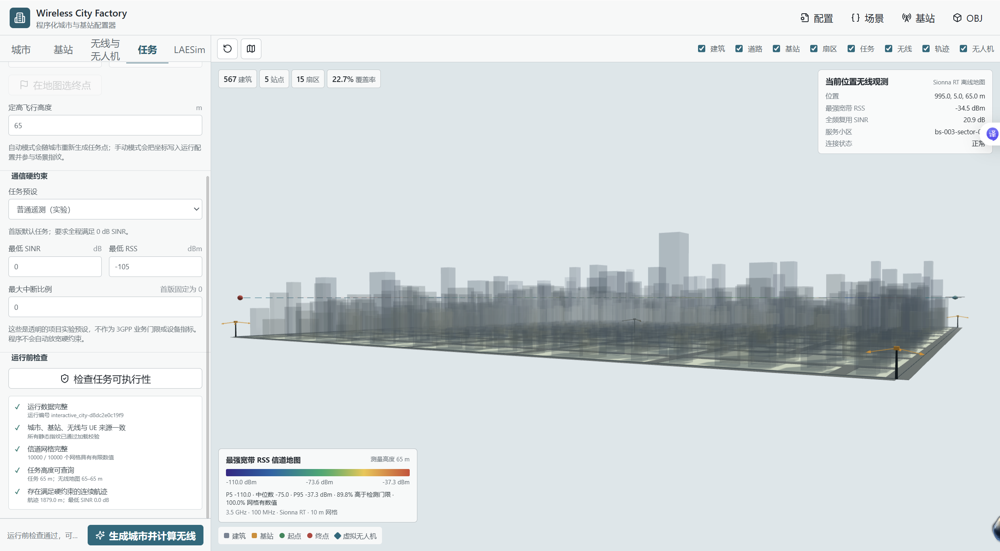
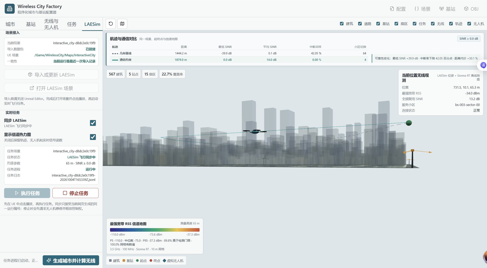
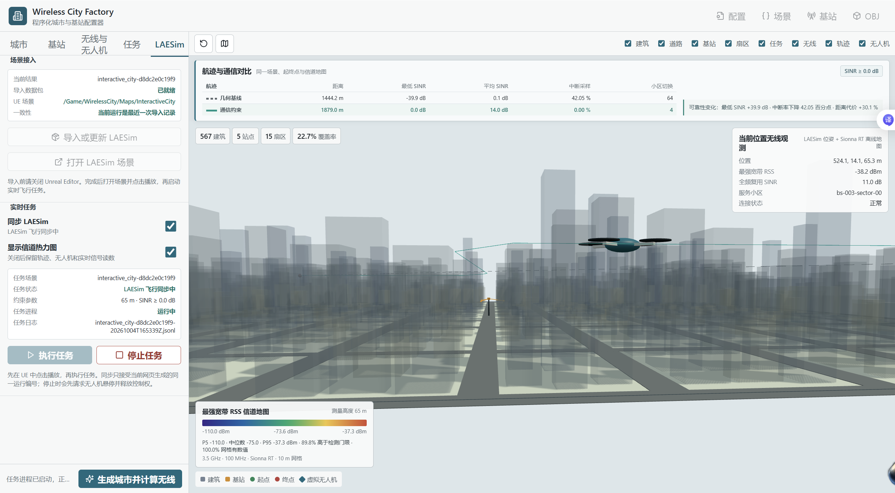
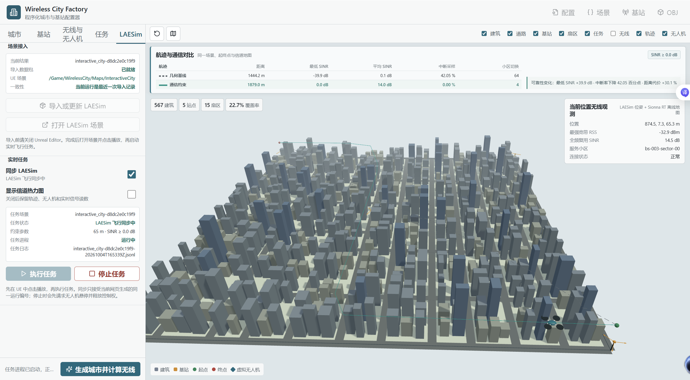
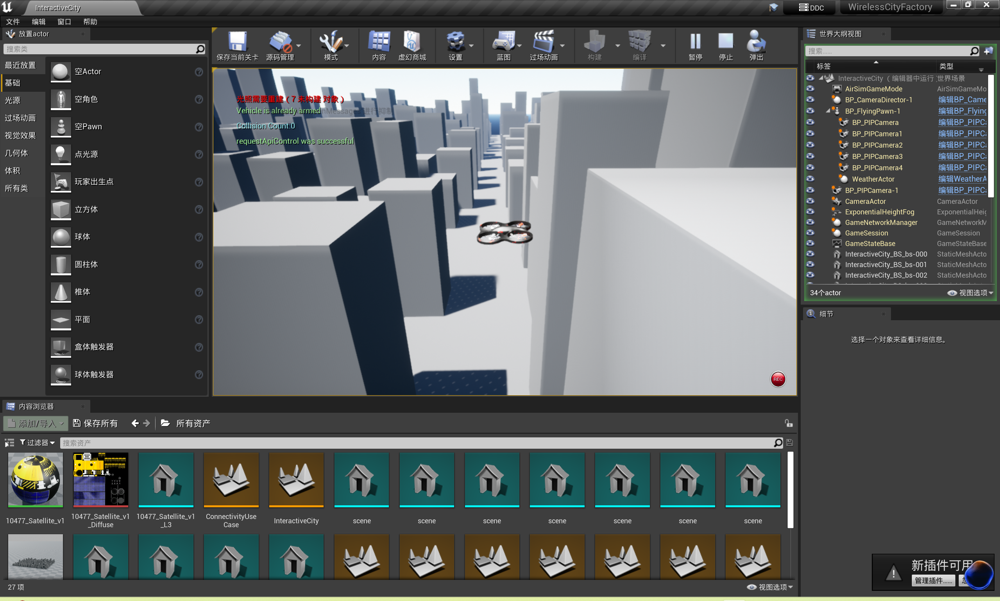
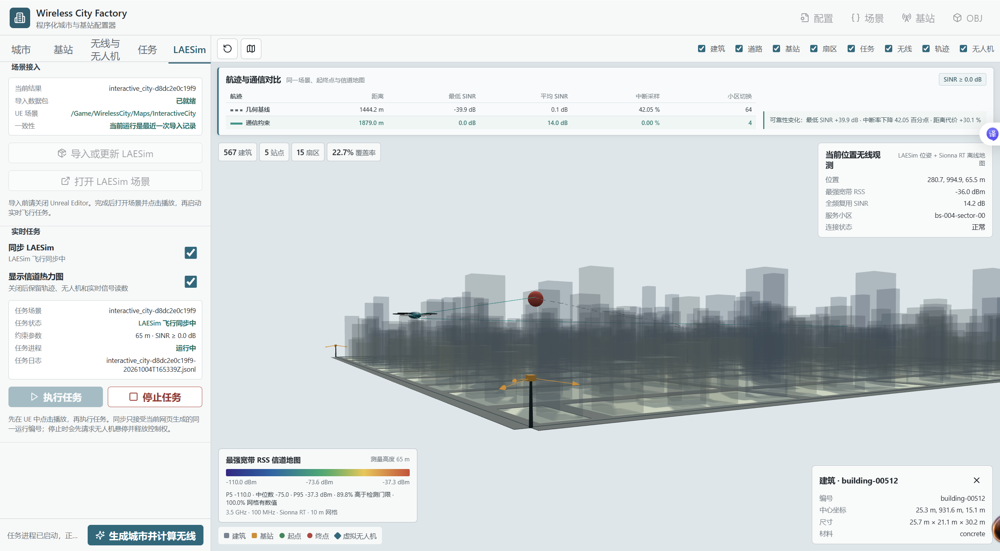
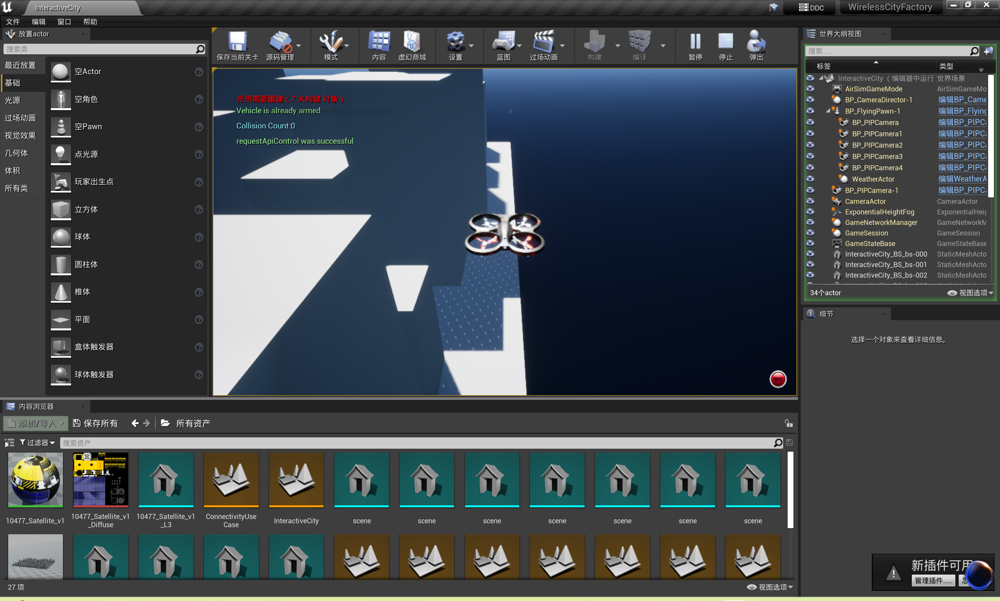
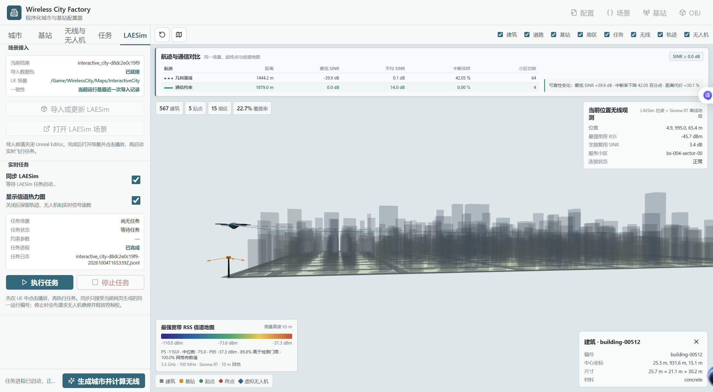

# RadioMapNav

RadioMapNav 是 LAESim 的低空通信约束导航应用：在同一城市与离线信道地图上比较几何基线和通信约束航迹，再通过 LAESim 原有 Python API 执行通信约束航迹。它不是独立仿真器，不另建城市生成器、无线后端或飞行动力学。

本文件是 `Examples/RadioMapNav` 唯一维护的 Markdown 说明，集中保存操作流程、规划方法、实验协议和验收结果。通用安装、场景生成及 UE 导入见 [SceneGen README](../../SceneGen/README.md)，基站配置、信道地图及客户端环境见 [RadioSim README](../../RadioSim/README.md)。以下命令均在 **LAESim 根目录**运行，代码和产物路径也以根目录为基准。

## 工程组织

| 路径 | 职责 |
| --- | --- |
| `SceneGen/python/laesim_scene/` | 统一场景、城市几何、OBJ、UE 导入包和网页配置 |
| `RadioSim/python/laesim_radio/` | Sionna RT 地图、无线查询、坐标转换和 LAESim API 桥接 |
| `Unreal/Environments/SceneGen/` | 公共 UE 4.27 宿主，使用本仓库 LAESim 插件 |
| `Examples/RadioMapNav/python/laesim_radio_nav/` | `planning.py` 规划器、`mission.py` 飞行任务、`export.py` 证据导出 |
| `Examples/RadioMapNav/scripts/` | 离线比较、实际飞行和证据导出的薄命令入口 |
| `Examples/RadioMapNav/configs/connectivity_usecase.yaml` | 当前可复现的小型通信约束案例 |
| `Examples/RadioMapNav/assets/usage/` | 导航任务、航迹与执行截图 |
| `Examples/RadioMapNav/verification/` | 已验收运行的 JSON/CSV 数据，不额外维护 README |
| `Examples/RadioMapNav/outputs/` | 本机生成的地图、航迹和日志，默认不进入 Git |
| `Examples/RadioMapNav/reference/` | 原交付 ZIP 和文件哈希清单，仅用于来源追溯 |

原 ZIP 内的目录与包名不是当前安装入口。旧目录下已有的本地环境和输出不删除，新的命令不依赖这些旧路径。

## 运行准备

按 [SceneGen 安装与启动](../../SceneGen/README.md#安装与启动)安装根目录 `laesim-tools`，实际射线追踪使用 `.venv-radio`。实际飞行还需要已构建的 LAESim 插件、UE 4.27 公共宿主和 [RadioSim 客户端环境](../../RadioSim/README.md#laesim-客户端环境)中的 `.venv-airsim310`。CPU 测试不要求 GPU、UE 或正在运行的 RPC 服务。

## 命令行流程

### 1 生成当前案例

默认配置是 400 m × 400 m Manhattan 城市，63 栋建筑、4 个站点/12 个扇区，任务起点 `(50,50,65)` m、终点 `(350,330,65)` m。信道地图使用 65 m 高度、20 m 网格、3.5 GHz 和 100 MHz 带宽，最低 SINR 门限为 0 dB。

```powershell
$generation = & .\.venv-radio\Scripts\python.exe -m laesim_scene generate --config Examples/RadioMapNav/configs/connectivity_usecase.yaml --project-root .
if ($LASTEXITCODE -ne 0) { throw '场景或信道生成失败' }
$runDir = ($generation | ConvertFrom-Json).output_dir
$runDir = (Resolve-Path -LiteralPath $runDir).Path
```

使用命令返回的 `output_dir`，不要把历史运行编号写死或自动选择另一个配置的最新目录。该命令调用平台模块生成统一几何、Sionna RT 地图和 UE 导入包；生成包不等于已导入 UE。

### 2 比较两条离线航迹

```powershell
& .\.venv-radio\Scripts\python.exe Examples/RadioMapNav/scripts/plan_connectivity_aware_route.py --run-dir $runDir --output (Join-Path $runDir 'route_comparison.json') --mode both --flight-altitude-m 65 --cruise-speed-mps 5 --minimum-sinr-db 0
```

`route_comparison.json` 的 `routes.baseline` 和 `routes.connectivity` 保存航迹点、长度、中断比例、最低/平均 SINR、最低/平均服务小区 RSS、切换次数和重规划次数。此阶段不运行 UE，也不表示两条航迹都已实际飞行。

### 3 导入 UE 并执行飞行

先按 [SceneGen UE 导入](../../SceneGen/README.md#ue-导入)构建公共宿主，把同一个 `$runDir` 导入 `Unreal/Environments/SceneGen/WirelessCityFactory.uproject`。默认案例地图为 `/Game/WirelessCity/Maps/ConnectivityUseCase`。

使用生成的 `ue_bundle/settings.json` 前备份原 `Documents/AirSim/settings.json`；网页导入会自动备份不同的原配置。打开正确地图并在 UE 点击 Play，再执行：

```powershell
$missionLog = Join-Path $runDir 'mission.jsonl'
& .\.venv-airsim310\Scripts\python.exe Examples/RadioMapNav/scripts/run_laesim_connectivity_mission.py --run-dir $runDir --output $missionLog --flight-altitude-m 65 --cruise-speed-mps 5 --minimum-sinr-db 0
```

任务依次连接、取得控制权、解锁、起飞、读取实际起点、规划并执行航迹，约每 0.25 s 记录真实位姿、碰撞和无线观测。默认车辆为 `UAV`，RPC 端口为 `41471`。任务会从实测起点重新规划，所以日志中的路线统计可能与精确配置坐标的离线比较略有不同。

飞行采用仓库 `PythonClient` 的位姿、碰撞、起飞及 `moveOnPathAsync` 等 API；网页不是另一套物理仿真。默认到达容差为 3 m，最终实际误差保留在 `final_error_m`，不将进入容差圈伪装成精确到点。

### 4 导出实验证据

日志必须以 `type=complete` 结束，并同时包含基线和通信约束路线。

```powershell
$evidenceDir = Join-Path $runDir 'evidence'
& .\.venv-radio\Scripts\python.exe Examples/RadioMapNav/scripts/export_paper_usecase.py --run-dir $runDir --mission-log $missionLog --output-dir $evidenceDir
```

网页任务的日志在 `SceneGen/runtime/missions/`，应把 `$missionLog` 指向界面显示的已完成日志。导出器校验城市、基站、无线地图、UE 包与 UE 导入结果的指纹；日志不完整或来源不一致时拒绝导出。

| 输出 | 内容 |
| --- | --- |
| `summary.json` | 配置与指纹、两条路线指标、差值、实际执行统计及来源路径 |
| `route_metrics.csv` | 两条规划航迹的表格指标 |
| `trajectory_points.csv` | 两条规划航迹的三维点列 |
| `flight_samples.csv` | LAESim 实际位置、无线观测、服务小区、中断及碰撞状态 |

导出器只生成数据，不生成另一份 README；结果的解释与实验边界统一维护在本文件。

## 网页操作

先生成默认案例，再从根目录启动公共场景工具：

```powershell
$env:LAESIM_UE_ROOT = 'E:\epgame\UE_4.27' # 按实际引擎安装位置设置
$env:LAESIM_SCENE_OUTPUT = (Resolve-Path Examples/RadioMapNav/outputs).Path
& .\.venv-radio\Scripts\python.exe -m laesim_scene.web_app --no-browser
```

访问终端打印的地址，默认 `http://127.0.0.1:8765/`。城市、基站和热力图配置参见两个平台模块 README；如果在网页重新生成，后续任务必须使用网页返回的同一运行目录，不能沿用先前的 `$runDir`。

以下截图保留原交付的 1 km 城市演示，界面旧标题可能仍为 Wireless City Factory。当前工具名称为 LAESim Scene Tools，模块路径和命令以本 README 为准；截图不代表当前 400 m 默认案例。

### 设置与检查任务

起终点支持自动推荐、地图点选和坐标输入。设置飞行高度、最低 SINR、可选最低 RSS 与最大允许中断比例，再运行可行性检查。高度必须在信道地图支持范围内。




### 同步并执行

在 LAESim 标签中导入场景并打开公共 UE 宿主，在 UE 点击 Play；然后启用“同步 LAESim”，点击“执行任务”。等待连接、规划及执行，以状态提示为准。网页会读取真实位姿，不需要另外计算一份信道地图；执行期间保持 UE 正在运行。



城市可半透明显示，便于观察无人机；也可关闭热力图，只查看几何基线与通信约束航迹。







网页与 UE 中的无人机应同时到达相同位置，例如城市边缘：







上述历史演示显示最低 SINR 提高约 39.9 dB、中断比例由 42.05% 降至 0%、距离增加 30.1%。中断比例变化是下降 42.05 个百分点，不是 42.05% 的相对降幅。刷新页面会恢复当前/已完成任务与无线图层状态；指纹不匹配仍会被拒绝。

再次运行时，先结束任务；需要重新导入时关闭 UE，调整参数、重新生成并导入，然后再次打开正确地图和 Play。不能手动换成另一张地图后继续使用旧任务数据。

## 规划方法与参数

`baseline` 只考虑边界、建筑碰撞、动力学可行性和目标/长度代价，不用无线指标选路。`connectivity` 在相同约束上增加 RF 网格 A* 全局引导，搜索满足 SINR/RSS 门限的连续走廊，简化、重采样并再次检查整条航迹。

局部专家使用五次多项式 minimum-jerk 运动基元，满足起终点位置、速度和加速度条件。默认基元时长为 2 s、检查间隔为 0.05 s；安全候选经过边界、建筑及动力学过滤，再按代价选择，局部方法以滚动方式执行和重规划。

```text
Ctotal = wt*Ctarget + wl*Clength + wrf*Cradio + wh*Chandover
```

`Cradio` 表示相对通信门限的不足，`Chandover` 表示服务小区切换。权重不能代替硬门限；整条航迹超过允许中断比例会明确失败。该实现为 Neural-Primitive-inspired 确定性专家示例，不含 Npe2eNet、模仿学习、训练代码或权重。

| 参数 | 作用 |
| --- | --- |
| `--flight-altitude-m` | 规划与无线查询的统一高度，必须在地图支持范围内 |
| `--minimum-sinr-db` | 硬通信门限，当前案例为 0 dB |
| `--minimum-rss-dbm` | 可选服务小区宽带 RSS 门限，不是严格定义的 RSRP |
| `--maximum-outage-fraction` | 允许中断采样比例，默认 0 |
| `--radio-weight` / `--handover-weight` | 无线质量与服务小区切换代价，默认 6 / 0.5 |
| `--cruise-speed-mps` | 规划和跟踪速度；上述流程统一指定 5 m/s |
| `--maximum-speed-mps` / `--maximum-acceleration-mps2` | 候选轨迹峰值上限，默认 15 m/s / 20 m/s² |
| `--task-id` | 选择场景中的任务，不指定时使用第一个 |
| `--sample-period-s` | 实际飞行日志采样间隔，任务脚本默认 0.25 s |

离线比较脚本的默认巡航速度是 8 m/s，任务脚本默认为 5 m/s；公平实验应像上述命令一样显式统一速度。`-125 dBm` 检测门限只决定可检测小区集合，不是任务质量门限。通用坐标转换及地图查询规则见 [RadioSim](../../RadioSim/README.md#坐标与无线查询)。

## 实验协议与适用边界

本应用用于检验通信约束能否以距离代价换取更好的弱覆盖尾部可靠性，并在 LAESim 中完成航迹执行。对照只能改变规划模式：两条航迹必须共享场景、基站、信道指纹、起终点、飞行高度、速度及动力学上限。网页和导出器读取同一任务日志中的两条路线，不能拼接不同场景或不同运行结果。

应报告长度、任务耗时、重规划次数、最低/平均 SINR、最低/平均服务小区 RSS、中断比例、切换次数、碰撞采样数、最终误差和成功状态。最低 SINR 提升或零中断不保证平均 SINR 也提升，应保留不利指标。

验收需检查同一运行的离线对照、UE 中的真实运动、JSONL 中变化的实际位姿、碰撞与无线采样、正常结束及误差容差。正式论文实验应冻结网格、采样预算、业务门限与机型参数，覆盖多种城市、多种子及多起终点，报告均值、标准差、成功/失败率和规划耗时。40 m 网页快速预览只能演示趋势，不能直接当作高精度论文实验。

当前碰撞筛选使用建筑 AABB，LAESim 原生碰撞是执行期的额外检查。无线观测来自静态离线地图及插值；单高度案例将实际 XY 位置投影到 65 m 层，不是在每帧或实际瞬时高度重新求解信道。该案例不包含快衰落、动态遮挡、风场、负载与调度、数据包级投递、真实设备标定或训练网络，也不替代 ns-3 或真实网络测量。RPC 不能回报当前 UE 地图的场景指纹，应始终打开导入的同一张地图。

## 验收结果

### 当前目录下的复现与迁移验收

日期为 2026-10-06，环境为 Windows、Python 3.10.11、RTX 3090 24 GB（驱动 610.88）、Sionna RT 2.1.0、Mitsuba 3.9.1、Dr.Jit 1.5.0、NumPy 2.2.6 和 UE 4.27。旧 RPC 环境使用 NumPy 1.26.4、msgpack-rpc-python 0.4.1、Tornado 4.5.3、OpenCV contrib 4.10.0.84，实际加载本仓库 `PythonClient/airsim`。

当前配置种子为 20260824；每扇区 38 dBm、8×8 双极化阵列、下倾角 10°；每扇区 16,384 samples、最大路径深度 6，信道张量 `[12,1,20,20]`。几何、地图、UE 包和导入记录均校验指纹。

| 检查 | 结果 |
| --- | --- |
| 原发布时的示例 CPU 测试 | 105 项通过 |
| 平台迁移后的 CPU 测试 | 112 项通过 |
| 继承的 V1.5/V1.6 核心验证 | 通过；含 33 项 NetworkSim 单元测试和理想通信冒烟检查 |
| 真实 Sionna RT 与独立 RadioSim 构建 | CUDA 计算成功；复用源几何，不覆盖源场景 |
| 当前 LAESim AirLib 与公共 UE 宿主编译 | 通过 |
| UE 场景导入 | 全部 21 项检查通过 |
| 网页检查 | 1440×900 与 390×844 非空三维画布、相机可交互、无脚本错误及横向溢出 |
| LAESim 任务 | 正常完成，日志终止记录为 `complete` |

两次实际执行的结果与数据分别保留，不能混为同一次运行：

| 执行指标 | 原 V1.6 验收 | 平台迁移验收 |
| --- | ---: | ---: |
| 采样点数 | 378 | 378 |
| 碰撞 / SINR 中断采样数 | 0 / 0 | 0 / 0 |
| 采样轨迹长度 | 476.698 m | 475.467 m |
| 任务采样时长 | 99.558 s | 99.311 s |
| 三维终点误差 | 0.444 m | 0.441 m |
| 数据来源 | [原验收 JSON](verification/2026-10-06/summary.json) | [迁移验收 JSON](verification/integration-2026-10-06/summary.json) |

原验收的实际高度为 65.193–66.542 m，查询投影到 65 m 层。启动时地面接触不作为航路碰撞，所有已记录的飞行采样均无碰撞。LLVM 初始化提示未阻止 CUDA 计算，UE 默认材质/天气蓝图提示未阻止导入及飞行；相关材质、几何碰撞和视觉检查全部通过。

原发布时的精确坐标离线对照为：长度 411.029/476.533 m，中断比例 7.960%/0%，最低 SINR -3.229/0.037 dB，平均 SINR 10.390/12.520 dB，切换 5/2 次，重规划 39/4 次。该离线命令使用脚本默认 8 m/s；实际任务按 5 m/s 和实测起点重规划，数据包内对应长度约 410.85/476.53 m、中断比例约 8.46%/0%。应按各自协议解释，不把不同速度/起点的指标直接合并。

两个证据目录均保存 `summary.json` 和三份 CSV；仅通信约束航迹实际飞行，几何基线为离线规划。完整地图和原始任务日志保存在忽略的本机输出目录及 `SceneGen/runtime/`。原验收 JSON 中的旧绝对来源路径仅用于追溯，不是当前运行命令。

当前迁移运行目录为 `Examples/RadioMapNav/outputs/connectivity_usecase-14a83bb043c9`，单独信道构建目录为 `RadioSim/outputs/integration-radio-20261006`。原运行编号为 `connectivity_usecase-9608b3f43650`。完整配置/场景/基站/无线指纹见各自 JSON。迁移验收不表示已经推送或创建新的 GitHub 发布，原 ns-3 后端未变更，也未在这两次应用验收中重跑真实 ns-3 runner。

### 原交付的 1 km 密集城市案例

以下保留原 Word 的场景、表格与结果，本次整理未重新验证该历史实验。它不是当前默认的 400 m 配置，也不保证仅切换城市预设就能重现原数值。

| 场景与任务 | 原记录 |
| --- | --- |
| 范围与形态 | 1000 m × 1000 m，BSP/T 字路密集高层城区 |
| 随机种子 | 20260821 |
| 建筑与道路 | 567 栋建筑、25 条道路 |
| 建筑高度 | 25–140 m，平均约 58.0 m |
| 实际建筑占地率 | 22.73% |
| 65 m 高度自由空间 | 93.14%，单一连通分量 |
| 起点 / 终点 | `(995,5,65)` / `(5,995,65)` m |


| 基站与信道 | 原记录 |
| --- | --- |
| 站点与扇区 | 5 个 Sub-6 GHz 低空宏站，每站 3 扇区，共 15 扇区 |
| 载波与带宽 | 3.5 GHz、100 MHz |
| 发射功率 | 49 dBm/扇区 |
| 站高与下倾角 | 25 m、8° |
| 扇区方位角 | 0°、120°、240° |
| 天线模型 | TR 38.901 方向图、8×8 双极化阵列 |
| 无线后端与网格 | Sionna RT 2.1.0，65 m 高度、10 m 分辨率、100×100 网格 |
| 信道张量与干扰 | `[15,1,100,100]`，15 扇区全频复用 |

站高、功率与密度是该实验的仿真代理值，不是特定设备或业务的强制标准。RSS 是配置带宽内的宽带接收功率，不是按完整 3GPP 测量流程定义的 RSRP。场景与 UE 使用同一几何，坐标变换为 `(100x,-100y,100z)`。


该案例要求 SINR 不低于 0 dB、服务小区 RSS 不低于 -105 dBm、最大中断比例为 0，巡航速度为 5 m/s。规划器检查几何、动力学及通信，只有通信约束路线经 LAESim 实际执行。


| 指标 | 几何基准 | 通信约束 | 变化 |
| --- | --- | --- | --- |
| 航迹长度 | 1444.2 m | 1879.0 m | +30.1% |
| 最低 SINR | -39.9 dB | 0.002 dB | +39.9 dB |
| 平均 SINR | 0.1 dB | 14.0 dB | +13.9 dB |
| 中断比例 | 42.05% | 0% | -42.05 个百分点 |
| 最低服务小区 RSS | -124.8 dBm | -65.9 dBm | +58.9 dB |
| 小区切换 | 64 | 4 | -93.75% |
| 到达终点 | 是 | 是 | 无变化 |

几何基线较短，但经过建筑遮挡形成的弱覆盖区域；通信约束航迹绕行连续覆盖区域。实际日志含 1446 个飞行采样点，终点 `(4.851,995.003,65.431)` m，三维误差 0.456 m，无检测到的碰撞；实测最低 SINR 0.041 dB、平均 SINR 14.036 dB、最低服务小区 RSS -65.75 dBm，与原规划统计基本一致。

该历史单场景结果只用于展示外部无线环境接入与通信约束规划的执行能力，不能外推为设备性能、多场景成功率或真实网络效果。
