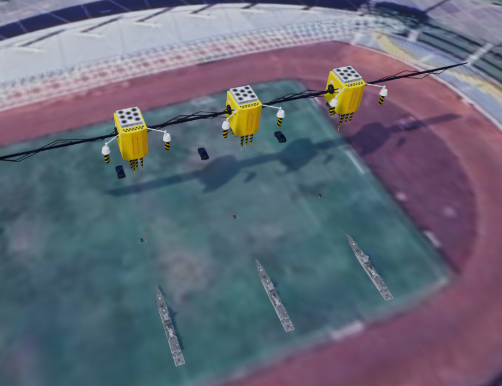
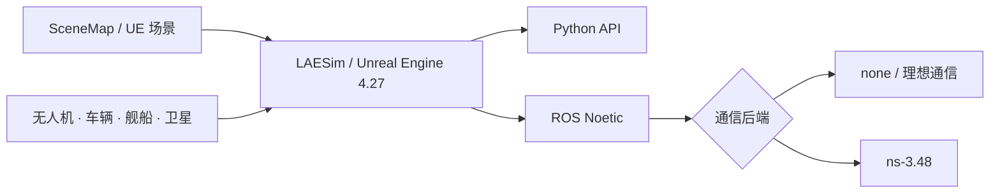

# LAESim

面向空天地海协同研究的多载具仿真平台

**维护单位：哈尔滨工业大学（深圳）广东省空天网络与智能感知实验室**

[项目展示页](https://sanis-hitsz.github.io/LAESim/) · [项目文档](https://sanis-hitsz.github.io/LAESim/documentation/) · [安装与构建](https://sanis-hitsz.github.io/LAESim/laesim_build/) · [仿真案例](https://sanis-hitsz.github.io/LAESim/simulation_cases/)

LAESim 基于 Microsoft AirSim 和 Unreal Engine 4.27 扩展，面向无人机、车辆、舰船与卫星协同任务。项目将多类型载具、图片地图、Python/ROS 接口和可选 ns-3 自组织网络仿真组织在同一套场景配置与实验流程中。

当前维护分支为 **`V1.4`**。

## 核心能力

| 能力 | LAESim V1.4 |
| --- | --- |
| 混合载具 | 同一 `AirGround` 场景运行无人机、车辆、舰船和卫星 |
| SceneMap | 将图片加载为可碰撞地图，支持比例尺、GPS 配准和坐标转换 |
| 仿真接口 | Windows Python API、ROS Noetic topic/service、多实例独立端口 |
| 网络后端 | `none` 理想通信或 ns-3 Wi-Fi ad hoc、OLSR/AODV |
| 实验指标 | 时延、吞吐量、丢包率以及后续可扩展的路由变化记录 |
| 可复现工程 | settings 模板、构建脚本、ROS/ns-3 安装脚本和冒烟测试 |

## 系统架构

Windows 负责 UE 场景、物理、画面和传感器生成；WSL2 可选运行 ROS Noetic 与 ns-3。不开启 ns-3 时，现有控制和感知流程仍按理想通信运行。

## 支持的载具

| 载具 | `VehicleType` | 默认 RPC 端口 | 模型边界 |
| --- | --- | --- | --- |
| 无人机 | `SimpleFlight` | `41471` | 继承 AirSim 多旋翼能力 |
| 车辆 | `PhysXCar` | `41461` | PhysX 地面车辆 |
| 舰船 | `SimpleBoat` / `PhysXBoat` | `41481` | 简化平面三自由度，不模拟完整水动力 |
| 卫星 | `SimpleSatellite` | `41491` | 三维理想质点，不模拟轨道摄动与重力 |
| 通用/CV | 不限定 | `41451` | 场景、相机与通用仿真 API |

## SceneMap

SceneMap 将任务图片或卫星图转换为 UE 中的可碰撞平面地图，并建立三套坐标之间的关系：

- 图片像素坐标 `U/V`
- 地图局部米制坐标 `MapX/MapY`
- GPS 经纬度与海拔

载具可以通过 `StartOnSceneMap` 按像素、米制坐标或 GPS 出生；Python API 和 ROS 服务可以在运行时加载、卸载、查询地图并进行坐标转换。

配置与接口说明见[使用 LAESim](https://sanis-hitsz.github.io/LAESim/laesim_use/)和[图片场景地图说明](如何加入图片场景地图功能.md)。

## ROS 与 ns-3

LAESim 保留两种可切换的通信模式：

- `Backend: none`：消息直接转发，用于算法基线和常规控制/感知调试。
- `Backend: ns3`：消息经过 ns-3 Wi-Fi ad hoc 网络，用于研究通信范围、路由、时延、吞吐量和丢包对协同任务的影响。

当前集成采用消息级网络仿真。UE 仍负责生成画面和传感器数据，应用按真实字节数向网络桥接器提交消息；图像和视频需要由应用完成压缩、分片、重组与解码。

## 仓库结构

| 路径 | 内容 |
| --- | --- |
| `AirLib/` | 通用仿真、载具 API、RPC 类型与设置解析 |
| `Unreal/Plugins/AirSim/` | UE 4.27 插件、Pawn、SimMode 与 SceneMap 实现 |
| `PythonClient/` | AirSim/LAESim Python 客户端 |
| `Multi_use/` | 无 ROS 控制、传感器和 SceneMap 工具 |
| `ros/` | ROS Noetic 工作空间、消息、服务与示例 |
| `NetworkSim/` | 可选 ns-3 runner、ROS 网络桥接器和测试 |
| `how_to_use_settings/` | 单载具、混合载具、卫星和 SceneMap 配置模板 |
| `docs/` | LAESim 中文文档与展示页内容 |

## 文档导航

- [核心特色](https://sanis-hitsz.github.io/LAESim/laesim_features/)
- [安装与构建 LAESim](https://sanis-hitsz.github.io/LAESim/laesim_build/)
- [使用 LAESim](https://sanis-hitsz.github.io/LAESim/laesim_use/)
- [仿真案例](https://sanis-hitsz.github.io/LAESim/simulation_cases/)
- [Multi_use 使用说明](https://github.com/SANIS-HITSZ/LAESim/blob/V1.4/Multi_use/README_zh.md)
- [ROS 示例说明](https://github.com/SANIS-HITSZ/LAESim/blob/V1.4/ros/src/example/README_zh.md)

安装步骤、编译问题、WSL2、ROS Noetic 与 ns-3 环境配置统一维护在“安装与构建 LAESim”页面，根 README 不再重复维护安装教程。

## 验证状态

V1.4 已验证以下链路：

- Windows AirLib Release 与 UE 4.27 `BlocksEditor Win64 Development` 编译
- ROS Noetic 消息、服务和 wrapper 编译
- Python/JSON 配置语法检查
- ns-3 通信范围内交付与范围外超时丢包
- GitHub Pages 文档构建与发布

运行时模型外观、碰撞、SceneMap 坐标方向和具体任务算法仍应在目标 UE 场景中按实验配置验证。

## 开源与上游

LAESim 基于 [Microsoft AirSim](https://github.com/microsoft/AirSim) 扩展。仓库主体许可见 [LICENSE](LICENSE)；[`NetworkSim/ns3/laesim-ns3-runner.cc`](https://github.com/SANIS-HITSZ/LAESim/blob/V1.4/NetworkSim/ns3/laesim-ns3-runner.cc) 声明为 `GPL-2.0-only`，并依赖同为 GPLv2 体系的 ns-3。分发或修改相关代码时应分别遵循对应许可。

## 项目团队

**开发与维护单位：哈尔滨工业大学（深圳）广东省空天网络与智能感知实验室**

| 角色 | 姓名 | 联系方式 |
| --- | --- | --- |
| 实验室负责人 | 张霆廷 | [zhangtt@hit.edu.cn](mailto:zhangtt@hit.edu.cn) |
| 实验室负责人 | 梁天豪 | [liangth@hit.edu.cn](mailto:liangth@hit.edu.cn) |
| 主要贡献者 | 平雨奇 | [pingyq@stu.hit.edu.cn](mailto:pingyq@stu.hit.edu.cn) |
| 主要贡献者 | 吴俊炜 | [220210419@stu.hit.edu.cn](mailto:220210419@stu.hit.edu.cn) |

本表按角色分组，不表示贡献排序。团队名单与署名原则见 [CONTRIBUTORS.md](CONTRIBUTORS.md)。

## 引用

在论文、报告或其他项目中使用 LAESim 时，请引用所使用的版本，并在方法或实验环境中提供仓库链接。机器可读的引用信息见 [CITATION.cff](CITATION.cff)。平台论文公开后，将在该文件中增加论文的 `preferred-citation`。

## 维护与贡献

问题反馈和功能讨论请优先通过 [GitHub Issues](https://github.com/SANIS-HITSZ/LAESim/issues) 提交，代码与文档改进请通过 Pull Requests 参与；当前开发和文档修改以 `V1.4` 分支为准。
