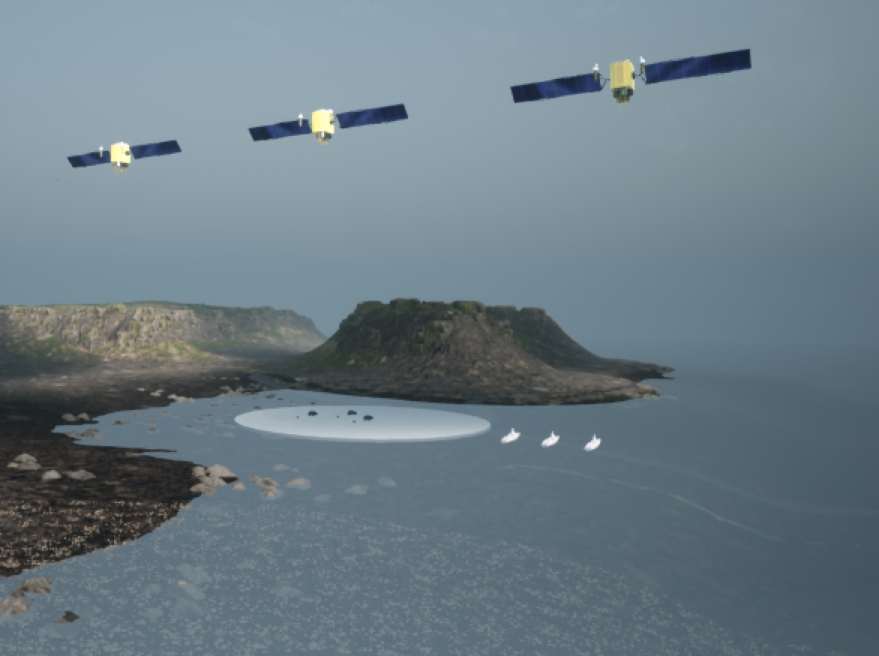
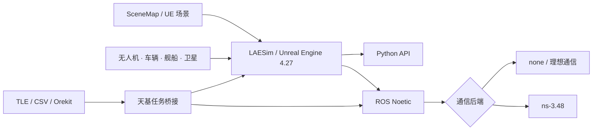

# LAESim

面向空天地海协同研究的多载具仿真平台

[](https://github.com/SANIS-HITSZ/LAESim/actions/workflows/verify_v15_core.yml?query=branch%3AV1.5)
[](https://github.com/SANIS-HITSZ/LAESim/actions/workflows/test_docs.yml?query=branch%3AV1.5)

**维护单位：哈尔滨工业大学（深圳）广东省空天网络与智能感知重点实验室**

[项目展示页](https://sanis-hitsz.github.io/LAESim/) · [项目文档](https://sanis-hitsz.github.io/LAESim/documentation/) · [安装与构建](https://sanis-hitsz.github.io/LAESim/laesim_build/) · [仿真案例](https://sanis-hitsz.github.io/LAESim/simulation_cases/)



LAESim 基于 Microsoft AirSim 和 Unreal Engine 4.27 扩展，面向无人机、车辆、舰船与卫星协同任务。项目将多类型载具、图片地图、Python/ROS 接口、天基任务分析和可选 ns-3 网络仿真组织在同一套场景配置与实验流程中。

当前开发版本为 **`V1.5`**，以公开版本 **`V1.4`** 为工程基线继续演进。

## 核心能力

| 能力 | LAESim V1.5 |
| --- | --- |
| 混合载具 | 同一 `AirGround` 场景运行无人机、车辆、舰船和卫星 |
| SceneMap | 将图片加载为可碰撞地图，支持比例尺、GPS 配准和坐标转换 |
| 仿真接口 | Windows Python API、ROS Noetic topic/service、多实例独立端口 |
| 天基任务 | TLE/SGP4、CSV、Orekit 可选后端，多星多目标覆盖与任务窗口分析 |
| 网络后端 | `none` 理想通信、ns-3 Wi-Fi ad hoc，或使用真实斜距预算的星地/星间逻辑链路 |
| 实验指标 | 时延、吞吐量、丢包、覆盖窗口、重访时间、链路切换与丢包原因 |
| 可复现工程 | settings 模板、构建脚本、ROS/ns-3 安装脚本和冒烟测试 |

## 系统架构



Windows 负责 UE 场景、物理、画面和传感器生成；WSL2 可选运行 ROS Noetic 与 ns-3。不开启 ns-3 时，现有控制和感知流程仍按理想通信运行。

## 支持的载具

| 载具 | `VehicleType` | 默认 RPC 端口 | 模型边界 |
| --- | --- | --- | --- |
| 无人机 | `SimpleFlight` | `41471` | 继承 AirSim 多旋翼能力 |
| 车辆 | `PhysXCar` | `41461` | PhysX 地面车辆 |
| 舰船 | `SimpleBoat` / `PhysXBoat` | `41481` | 简化平面三自由度，不模拟完整水动力 |
| 卫星 | `SimpleSatellite` | `41491` | UE 内为显示模型；真实轨道与任务几何由可选天基任务桥接计算 |
| 通用/CV | 不限定 | `41451` | 场景、相机与通用仿真 API |

## SceneMap

SceneMap 将任务图片或卫星图转换为 UE 中的可碰撞平面地图，并建立三套坐标之间的关系：

- 图片像素坐标 `U/V`
- 地图局部米制坐标 `MapX/MapY`
- GPS 经纬度与海拔

载具可以通过 `StartOnSceneMap` 按像素、米制坐标或 GPS 出生；Python API 和 ROS 服务可以在运行时加载、卸载、查询地图并进行坐标转换。

配置与接口说明见[使用 LAESim](https://sanis-hitsz.github.io/LAESim/laesim_use/)和[图片场景地图说明](如何加入图片场景地图功能.md)。

## 天基任务桥接

V1.5 将真实任务计算与 UE 演示坐标分离：TLE/SGP4、CSV 或可选 Orekit 后端负责卫星星历、目标可见性、覆盖窗口和重访统计，`SimpleSatellite` 只在 UE 中显示缩放后的轨迹。多星实时桥接、最佳卫星选择、链路切换、星地链路预算和星间多跳均作为可选流程启用，不启动相关脚本时不会改变原有载具仿真。

使用和验证方法见[天基任务桥接](docs/space_mission_bridge.md)与[交付检查清单](docs/space_delivery_checklist.md)。

## ROS 与 ns-3

LAESim 保留两种可切换的通信模式：

- `Backend: none`：消息直接转发，用于算法基线和常规控制/感知调试。
- `Backend: ns3`：地面节点消息可经过 ns-3 Wi-Fi ad hoc + OLSR/AODV；受 `SpaceAccessPolicy` 管理的星地/星间消息可按真实斜距、传播时延、链路预算和误码模型处理。

当前集成采用消息级网络仿真。UE 仍负责生成画面和传感器数据，应用按真实字节数向网络桥接器提交消息；图像和视频需要由应用完成压缩、分片、重组与解码。网络丢包统一发布到 `/network_sim/drop`，便于区分 access、链路预算、路由、范围和超时等阶段。

## 仓库结构

| 路径 | 内容 |
| --- | --- |
| `AirLib/` | 通用仿真、载具 API、RPC 类型与设置解析 |
| `Unreal/Plugins/AirSim/` | UE 4.27 插件、Pawn、SimMode 与 SceneMap 实现 |
| `PythonClient/` | AirSim/LAESim Python 客户端 |
| `Multi_use/` | 无 ROS 控制、传感器、SceneMap 和天基任务工具 |
| `ros/` | ROS Noetic 工作空间、消息、服务与示例 |
| `NetworkSim/` | 可选 ns-3 runner、ROS 网络桥接器和测试 |
| `Examples/quickstart/` | 异构载具、ns-3 与 GeoTIFF 稳定下视采集实验 |
| `how_to_use_settings/` | 单载具、混合载具、卫星和 SceneMap 配置模板 |
| `docs/` | LAESim 中文文档与展示页内容 |

## 文档导航

- [核心特色](https://sanis-hitsz.github.io/LAESim/laesim_features/)
- [安装与构建 LAESim](https://sanis-hitsz.github.io/LAESim/laesim_build/)
- [使用 LAESim](https://sanis-hitsz.github.io/LAESim/laesim_use/)
- [仿真案例](https://sanis-hitsz.github.io/LAESim/simulation_cases/)
- [天基任务桥接](docs/space_mission_bridge.md)
- [V1.5 基线同步说明](docs/v1_5_sync_notes.md)
- [快速入门实验](Examples/quickstart/README.md)
- [Multi_use 使用说明](Multi_use/README_zh.md)
- [ROS 示例说明](ros/src/example/README_zh.md)

安装步骤、编译问题、WSL2、ROS Noetic 与 ns-3 环境配置统一维护在“安装与构建 LAESim”页面，根 README 不再重复维护安装教程。

## 验证状态

V1.5 在继承 V1.4 验证项的基础上，已覆盖以下链路：

- Windows AirLib Release 与 UE 4.27 `BlocksEditor Win64 Development` 编译
- ROS Noetic 消息、服务和 wrapper 编译
- Python/JSON 配置语法检查
- ns-3 通信范围内交付与范围外超时丢包
- TLE/SGP4、多星多目标任务分析、覆盖窗口和重访报告
- 星地真实斜距链路预算、星间多跳、统一时钟和结构化丢包诊断
- GitHub Pages 文档构建与发布

仓库提供一个 Windows/Linux 通用的核心验证入口：

```bash
python NetworkSim/scripts/verify_v15_core.py
```

命令返回码为 `0` 且最后输出 `V1.5 CORE VERIFICATION: PASS` 时，表示可移植源码清单、JSON 配置、Python 语法、异构载具 quickstart、33 个确定性单元测试和理想通信后端冒烟测试全部通过。GitHub 每次 push/PR 都会自动运行同一脚本，页首 `V1.5 Core Verification` 绿色徽章表示当前 `V1.5` 分支通过该层验证，Actions 会保留完整日志作为构建产物。

该绿勾不代表 GitHub 云端启动了 UE、ROS 或真实 ns-3 runner。这些需要外部进程和特定开发环境的链路，应按[WSL2、ROS 与 ns-3](docs/laesim_wsl_ros_ns3.md)和[交付检查清单](docs/space_delivery_checklist.md)运行现场验收；只有得到具体包投递、非零时延、链路转换和 UE 位姿进展证据，才能说明对应的运行时链路 work。

运行时模型外观、碰撞、SceneMap 坐标方向和具体任务算法仍应在目标 UE 场景中按实验配置验证。

## 开源与上游

LAESim 基于 [Microsoft AirSim](https://github.com/microsoft/AirSim) 扩展。仓库主体许可见 [LICENSE](LICENSE)；`NetworkSim/ns3/laesim-ns3-runner.cc` 声明为 `GPL-2.0-only`，并依赖同为 GPLv2 体系的 ns-3。分发或修改相关代码时应分别遵循对应许可。

## 项目团队

**开发与维护单位：哈尔滨工业大学（深圳）广东省空天网络与智能感知重点实验室**

| 角色 | 姓名 | 联系方式 |
| --- | --- | --- |
| 实验室负责人 | 张霆廷 | [zhangtt@hit.edu.cn](mailto:zhangtt@hit.edu.cn) |
| 实验室负责人 | 梁天豪 | [liangth@hit.edu.cn](mailto:liangth@hit.edu.cn) |
| 主要贡献者 | 平雨奇 | [pingyq@stu.hit.edu.cn](mailto:pingyq@stu.hit.edu.cn) |
| 主要贡献者 | 吴俊炜 | [220210419@stu.hit.edu.cn](mailto:220210419@stu.hit.edu.cn) |
| 主要贡献者 | 雷光宇 | [guangyulei@stu.hit.edu.cn](mailto:guangyulei@stu.hit.edu.cn) |

本表按角色分组，不表示贡献排序。团队名单与署名原则见 [CONTRIBUTORS.md](CONTRIBUTORS.md)。

## 引用

在论文、报告或其他项目中使用 LAESim 时，请引用所使用的版本，并在方法或实验环境中提供仓库链接。机器可读的引用信息见 [CITATION.cff](CITATION.cff)。平台论文公开后，将在该文件中增加论文的 `preferred-citation`。

## 维护与贡献

问题反馈和功能讨论请优先通过 [GitHub Issues](https://github.com/SANIS-HITSZ/LAESim/issues) 提交，代码与文档改进请通过 Pull Requests 参与；V1.5 的变更范围见 [CHANGELOG.md](CHANGELOG.md)。
