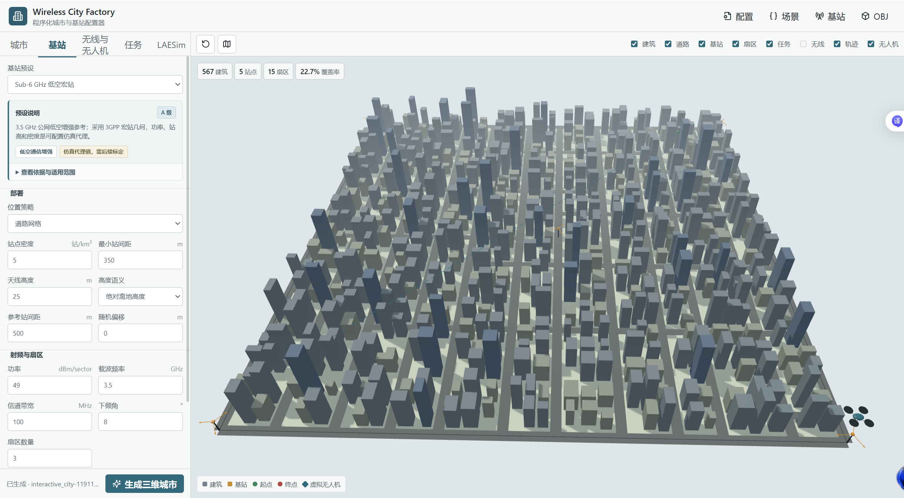
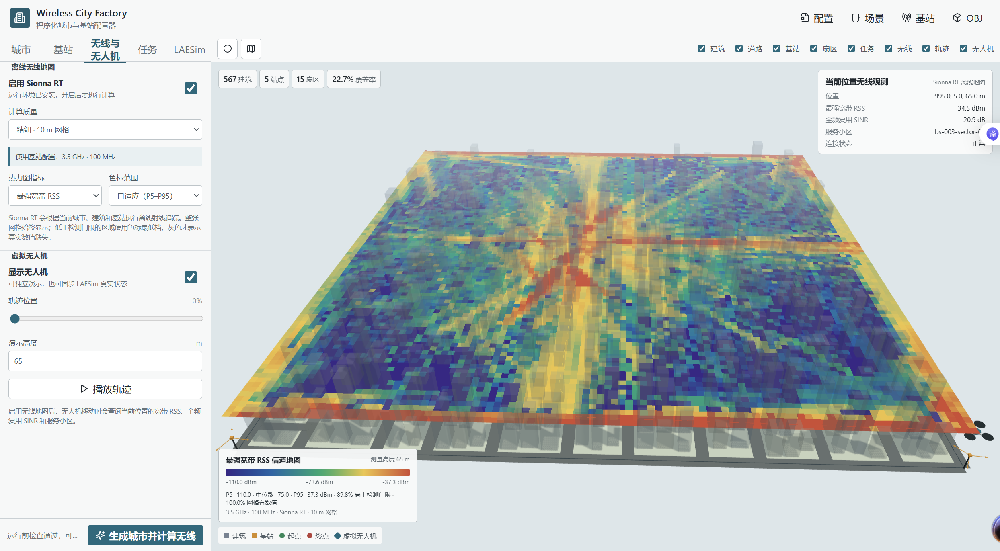

# LAESim RadioSim

RadioSim 是 LAESim 的通用离线信道仿真与查询模块：读取 [SceneGen](../SceneGen/README.md) 的统一几何和基站清单，调用 Sionna RT 生成多高度信道地图，再通过插值查询无线观测。导航规划和飞行应用归属 [RadioMapNav](../Examples/RadioMapNav/README.md)，不在本模块实现。

此 README 维护公共基站、信道与客户端说明。以下命令在 **LAESim 根目录**运行，根目录安装入口为 `laesim-tools`。实际射线追踪需要兼容的 NVIDIA GPU、Sionna RT 2.x 和 CUDA/OptiX；安装命令见 [SceneGen](../SceneGen/README.md#安装与启动)。CPU 测试不要求 GPU。

## 工程组织

| 根目录相对路径 | 内容 |
| --- | --- |
| `RadioSim/python/laesim_radio/base_stations.py` | 基站/扇区清单、部署元数据与一致性校验 |
| `RadioSim/python/laesim_radio/radio.py` | Sionna RT 后端、多高度采样与信道产物 |
| `RadioSim/python/laesim_radio/build.py` | 从已有场景发布新的信道快照 |
| `RadioSim/python/laesim_radio/runtime.py` | 指纹/哈希校验、地图查询及坐标转换 |
| `RadioSim/python/laesim_radio/laesim_bridge.py` | 原 LAESim API 的位姿、碰撞、LiDAR 与飞行桥接 |
| `RadioSim/configs/base_station_profiles/` | 基站部署、频段和天线预设 |
| `RadioSim/scripts/` | 采样预算评估、批量信道生成和无线观测 |
| `RadioSim/assets/usage/` | 基站配置与信道地图截图 |
| `RadioSim/outputs/` | 单独信道构建产物，本机生成目录 |

## 基站配置

网页基站面板支持低频广域、Sub-6 GHz 低空宏站、4.9 GHz 通感和毫米波实验预设，也保留 UMa/UMi 校准参考及项目中间档。可设置站点密度、道路/屋顶部署方式、站间距、天线高度、频率、带宽、每扇区功率、下倾角和扇区方位角。



截图为迁移前的 1 km 案例，当前入口在公共 LAESim Scene Tools 网页。截图参数与应用默认 400 m 案例不同，不应直接拼接比较。

预设不是认证设备参数。`source_evidence_level` 描述来源等级，`parameter_status` 描述数值性质；低空实验完整数值按 `simulation_proxy` 管理。UMa/UMi 是传播校准参考，不代表任意真实运营商网络。`absolute_agl` 是离地绝对高度，`mast_above_rooftop` 是屋顶以上桅杆高度，两者不可混用。修改预设参数后应记录自定义状态、来源预设和修改字段。

基站清单记录实际位置、站点与逻辑扇区、载频、带宽、功率、天线及部署来源。三扇区站点对应三个逻辑发射单元；统计物理站点与逻辑扇区时要明确口径。

## 信道地图构建

网页开启 Sionna RT 后，公共生成入口会同时计算无线地图；不开启时仍可生成城市和 UE 包。快速、平衡、精细档影响网格和采样成本，40 m 快速网格用于交互预览，正式实验需冻结预算并评估收敛。



也可单独为完整 SceneGen 运行目录构建新地图，不重新生成建筑：

```powershell
& .\.venv-radio\Scripts\python.exe -m laesim_radio build --scene-run '<SceneGen 运行目录>' --config '<城市参数相同且启用 radio 的配置>' --output RadioSim/outputs/my-radio-map
& .\.venv-radio\Scripts\python.exe -m laesim_radio query --run-dir RadioSim/outputs/my-radio-map --position 50 50 65
```

输入需要 `scene.json`、OBJ、基站、配置与完整阶段清单，城市参数和随机种子必须与源场景一致；仅调整信道设置，`radio.enabled` 必须为真。输出必须是源目录之外的新目录，不能覆盖已有场景或地图。失败时不发布完整结果。单独信道快照不自动重新导入 UE；需要导航飞行时仍需对应场景的 UE 包和导入记录。

`radio_volume.npz` 按 `[Tx,Z,Y,X]` 保存多层网格与各发射单元的线性路径增益、RSS/SINR 等数据，`radio_manifest.json` 记录指纹、参数与卷文件 SHA-256。新增地图可复用源几何，但参数变更后的无线结果不能与旧结果混用。

## 坐标与无线查询

场景与信道地图使用米、+Z 向上的 scene 坐标；UE 使用 `(x,-y,z)*100` 厘米。LAESim NED 坐标相对任务起点转换：

```text
north = scene_x - start_x
east  = start_y - scene_y
down  = start_z - scene_z
```

运行时先在**线性路径增益**域插值，再计算 RSS 和 SINR；加载时检查场景、基站、发射单元及卷文件哈希。超出地图范围会报错，不把越界位置默默钳到网格边界。LiDAR 保留 LAESim 返回的传感器坐标帧，不猜测外参或伪装成世界坐标。

RSS 是配置带宽内的宽带接收功率，不是严格 3GPP RSRP；某些兼容字段仍称 `rsrp_dbm`，不改变指标定义。SINR 假定所有逻辑扇区同频、同时满负载发射。`-125 dBm` 小区检测门限与导航业务 RSS/SINR 门限是不同概念。

网页可以在 RSS/SINR 热力图间切换，按可检测网格 P5–P95 自适应色标，也可使用固定色标比较运行。低于检测门限但有效的数值仍按色标最低档显示，灰色表示缺失值；图例分别报告可检测比例和有效网格比例。图层开关不改变数据。

传播始终使用配置的真实载频。超出 ITU 材料参数有效范围时，只将材料介电常数/电导率取值钳到最近有效边界并记录“材料边界代理”；例如 700 MHz 下混凝土/干燥地面取 1 GHz 材料值，26 GHz 下干燥地面取 10 GHz 值。这是透明工程近似，不是完整频段材料标定。

单层地图只支持该高度的查询。RadioMapNav 定高示例将实际 XY 位置投影到指定层，保留真实位姿但不重新求解瞬时高度信道；它不代表多高度在线规划。地图查询约束和实际飞行统计应分别报告。

## LAESim 客户端环境

旧 AirSim RPC 栈与现代 Sionna RT 依赖不同，建议分开环境。先按根目录构建说明准备 LAESim/UE，再在根目录安装客户端依赖：

```powershell
py -3.10 -m venv .venv-airsim310
& .\.venv-airsim310\Scripts\python.exe -m pip install 'numpy==1.26.4' PyYAML msgpack-rpc-python 'opencv-contrib-python==4.10.0.84'
& .\.venv-airsim310\Scripts\python.exe -m pip install -e . --no-deps
& .\.venv-airsim310\Scripts\python.exe -c "from laesim_scene.repository import load_laesim_client; print(load_laesim_client().__file__)"
```

最后一行应显示当前仓库 `PythonClient/airsim/__init__.py`。不需要另装独立 `airsim` 包；已加载其他 AirSim 客户端时会拒绝混用，应在正确环境重启进程。`LAESIM_CLIENT_PYTHON` 可指定网页任务使用的客户端解释器，默认根目录 `.venv-airsim310/Scripts/python.exe`。

`LAESimBridge` 复用现有 RPC 的位姿、碰撞、LiDAR、起飞、定高与路径跟踪，不新增动力学或替代原接口。实际控制需要正确的 UE 地图正在 Play；导航任务命令和证据导出归属 RadioMapNav README。

## 适用边界

无线地图是静态、场景相关的离线传播结果，运行时不逐帧射线追踪，不包含动态遮挡、快衰落、真实负载与调度或包级投递。RadioSim 不替代 `NetworkSim` 的 ns-3 后端，也不声称能直接转换任意现有 UE 地图或动态物体。

预设、材料代理、射线预算、接收高度及网格分辨率都应显式记录，不能把实验代理数值表述为强制标准或设备认证性能。多场景、多种子统计及实际飞行应用的已验证结果统一见 [RadioMapNav 验收结果](../Examples/RadioMapNav/README.md#验收结果)。
