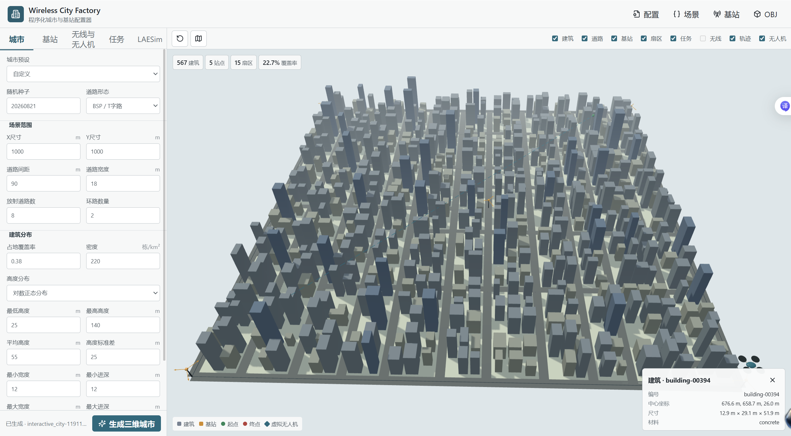
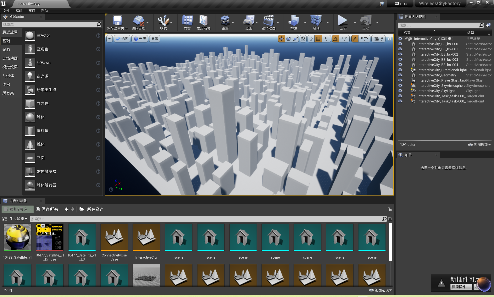
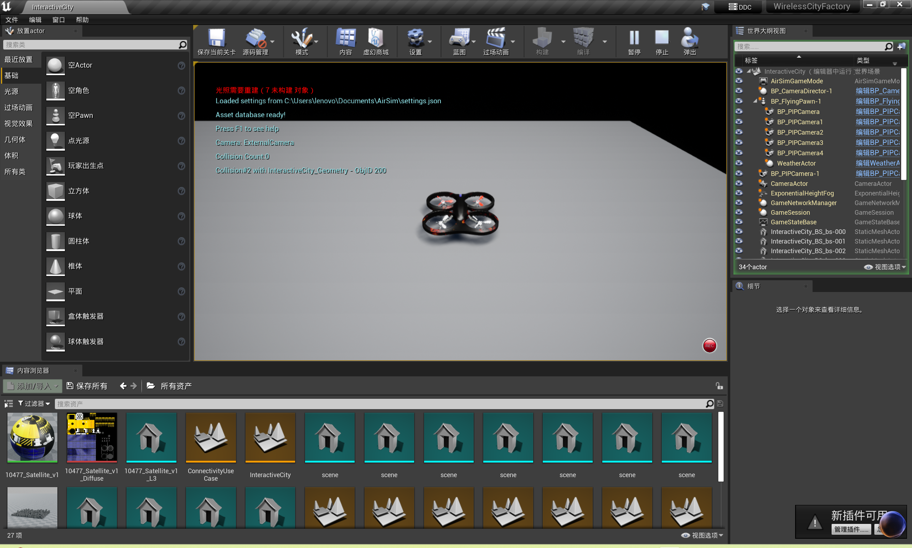

# LAESim SceneGen

SceneGen 是 LAESim 的通用程序化场景生成、网页配置和 UE 导入模块，不是独立仿真器。本 README 维护公共场景工具的安装与操作，导航应用的任务、规划及结果统一见 [RadioMapNav README](../Examples/RadioMapNav/README.md)。以下命令在 **LAESim 根目录**运行。

## 数据流与工程组织

网页提交参数，本地 Python 服务生成 `scene.json`、`scene.obj`、`city_manifest.json` 和 `base_station_manifest.json`。浏览器预览、[RadioSim](../RadioSim/README.md) 射线追踪及 UE 导入复用统一几何，信道计算与 UE 场景生成是两条支路，UE 导入不需要先得到信道结果。

网页不运行物理引擎；生成 UE 包后，还需执行 UE 导入才会创建 `.umap`、碰撞几何和实际 LAESim 场景。场景坐标为米、+Z 向上，UE 转换为 `(x,-y,z)*100` 厘米。基站和信道指纹防止过期数据被跨场景复用。

| 根目录相对路径 | 内容 |
| --- | --- |
| `SceneGen/python/laesim_scene/` | 城市、配置、统一场景、几何验证、OBJ、UE 导入包及网页服务 |
| `SceneGen/configs/` | 公共场景和批量城市配置 |
| `SceneGen/scripts/` | 网页启动、批量生成、插件准备、UE 构建及导入验证 |
| `SceneGen/assets/usage/` | 城市配置与 UE 导入操作截图 |
| `SceneGen/runtime/` | 本机网页状态、最近 UE 导入记录和网页任务日志 |
| `SceneGen/outputs/` | CLI 场景预设的默认输出位置 |
| `Unreal/Environments/SceneGen/` | 公共 UE 4.27 宿主，内部项目名保留 WirelessCityFactory |

`WirelessCityFactory` 的内部 UE 名称为资产兼容而保留，不表示宿主仍在示例目录或需要独立 AirSim 项目。源码来源和许可见 [PROVENANCE](PROVENANCE.md) 和 [LICENSE](LICENSE)。

## 安装与启动

```powershell
py -3.10 -m venv .venv-radio
& .\.venv-radio\Scripts\python.exe -m pip install -e ".[dev,rt]" "sionna-rt==2.1.0"
& .\.venv-radio\Scripts\python.exe -m pytest
& .\.venv-radio\Scripts\python.exe -m laesim_scene.web_app
```

仅生成城市可安装 `.[dev]`，不要求 Sionna RT、GPU 或 UE。实际信道求解的依赖与运行边界见 [RadioSim](../RadioSim/README.md)。工具从仓库根目录安装为 `laesim-tools`；在其他工作目录使用时，`LAESIM_ROOT` 可指定 LAESim 源码根目录。

也可双击 `SceneGen/scripts/StartVisualizer.bat`，它从根目录选择 `.venv-radio` 或 `.venv`。网页默认地址是 `http://127.0.0.1:8765/`；端口占用时使用终端打印的实际地址，关闭服务时按 Ctrl+C。

网页默认产物为 `%LOCALAPPDATA%/LAESim/SceneGen/outputs`，CLI 产物按配置 `global.output`、相对 `--project-root` 保存；导航案例配置使用 `Examples/RadioMapNav/outputs`。不要把网页默认输出与 CLI 输出混用。

```powershell
$env:LAESIM_SCENE_OUTPUT = Join-Path (Get-Location).Path 'SceneGen/outputs'
$env:LAESIM_UE_ROOT = 'E:\epgame\UE_4.27' # 按实际安装位置设置
& .\.venv-radio\Scripts\python.exe -m laesim_scene.web_app --no-browser
```

`LAESIM_SCENE_OUTPUT` 指定网页输出；`LAESIM_UE_ROOT` 指定引擎；`LAESIM_UE_PROJECT` 可指定其他兼容 LAESim 宿主。旧 `WCF_VISUALIZER_OUTPUT` / `WCF_UE4_ROOT` 仅为兼容保留，新说明统一使用 `LAESIM_*`。

## 城市配置与几何生成

网页的城市面板可选择密集高层网格、不规则中层城区、紧凑放射低层和稀疏郊区，设置种子、范围、道路、建筑密度、占地覆盖率及高度/尺寸分布。不同种子改变个体建筑；不同城市预设改变形态和分布。同样配置和种子可复现同一场景。

生成器检查边界、建筑冲突、道路避让、自由空间连通及任务点。斜路、T 字路、放射路和环路都参与几何检查。目前只生成平地与静态建筑，不生成山地、坡地、桥梁或动态障碍。



截图保留原交付的 1 km 案例，旧界面标题可能为 Wireless City Factory。当前网页名称为 LAESim Scene Tools，当前路径和命令以本 README 为准；截图中的数值不是所有预设的默认值。

```powershell
& .\.venv-radio\Scripts\python.exe -m laesim_scene generate --config SceneGen/configs/city_only.yaml --project-root .
& .\.venv-radio\Scripts\python.exe -m laesim_scene generate-candidates --config SceneGen/configs/city_set_v1.yaml --city-profiles dense_highrise_grid irregular_midrise sparse_suburban --seeds 20260821 20260822 20260823 --project-root .
```

命令返回运行编号及 `output_dir`。`city_only.yaml` 关闭无线和 UE；`city_ue.yaml` 启用 UE 包；启用 `radio.enabled` 时调用 RadioSim。批量城市集合要求无线与 UE 阶段关闭，按形态/种子矩阵生成几何及汇总，不把城市选择直接当作传播验证。

## UE 导入

按 [LAESim 构建说明](../docs/laesim_build.md)编译主工程后，在根目录执行：

```powershell
$engineRoot = 'E:\epgame\UE_4.27' # 按实际安装位置设置
& SceneGen/scripts/SetupLAESim.ps1
& SceneGen/scripts/BuildProject.ps1 -EngineRoot $engineRoot
& SceneGen/scripts/ImportExampleCity.ps1 -BundleRoot '<生成命令返回的 output_dir>' -EngineRoot $engineRoot
```

`SetupLAESim.ps1` 复制本仓库已有的 LAESim 插件和兼容资源，不下载另一套 AirSim。插件已准备好时无需重复 Setup；只有明确更新副本时才使用 `-Force`。默认项目为 `Unreal/Environments/SceneGen/WirelessCityFactory.uproject`，构建、导入及验证脚本支持 `-ProjectFile` 指定兼容宿主。

配置必须启用 `ue.enabled`。导入脚本读取同一运行的 OBJ、基站和任务点，生成地图并运行导入验证；也可单独调用 `SceneGen/scripts/ValidateExampleCity.ps1 -BundleRoot '<run>' -EngineRoot $engineRoot`。UE 包文件检查可用 `python -m laesim_scene validate-ue '<run>'`，它不替代实际 UE 导入及验证。



网页中的“导入或更新 LAESim”调用相同脚本，备份有差异的 `Documents/AirSim/settings.json` 并复制当前运行的 `ue_bundle/settings.json`。直接运行 PowerShell 导入脚本不会自动切换用户 settings，需自行备份并配置。导入前关闭正在使用该项目的 UE Editor，避免资产被占用。

“打开 LAESim 场景”打开当前导入的地图；必须在 UE 点击 Play 才能进行 RPC 飞行。



导航任务的起终点、通信约束、同步、执行和日志解释见 [RadioMapNav](../Examples/RadioMapNav/README.md#网页操作)，不要通过网页预览宣称已经完成物理飞行。

## 三维查看与结果管理

支持相机旋转、缩放、平移、透视/俯视切换，建筑、道路、站点、扇区及任务图层开关，对象点选，以及 `config.json`、场景 JSON、基站清单和 OBJ 下载。无线热力图说明见 RadioSim；不同图层的显示开关不改变源几何或求解结果。

每个运行目录保存配置与阶段清单，只有完整、匹配的指纹才允许复用；失败阶段不会发布成功运行。导入标记证明数据与最近一次导入相符，但当前 RPC 不提供 UE 实际加载地图的指纹，不能手动换图后继续使用旧任务。

源码打包使用根目录 `PreparePortableSource.ps1 -DestinationRoot '<空目录>'`，不再使用独立 WirelessCityFactory 验收打包入口。虚拟环境、生成地图、运行状态、复制插件和 UE 编译产物不进入普通源码交付。原 ZIP 留在 `Examples/RadioMapNav/reference/`。
