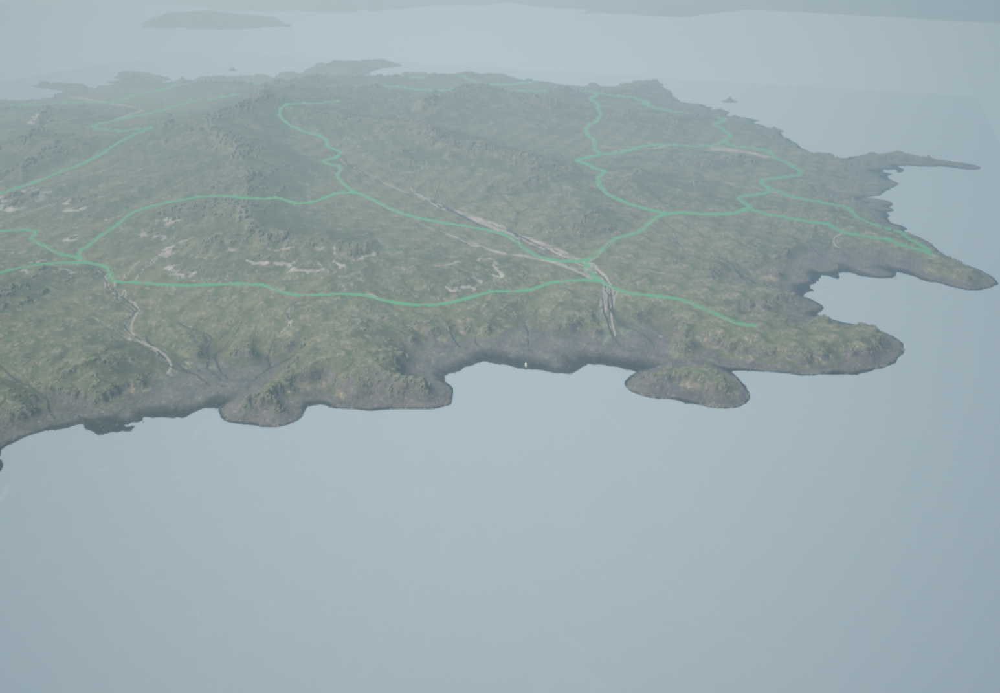
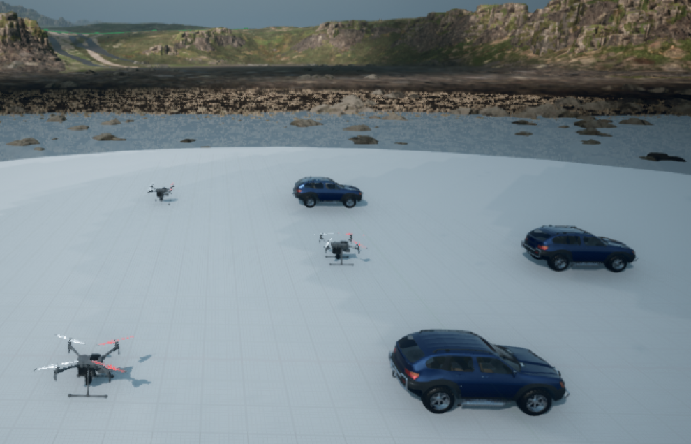
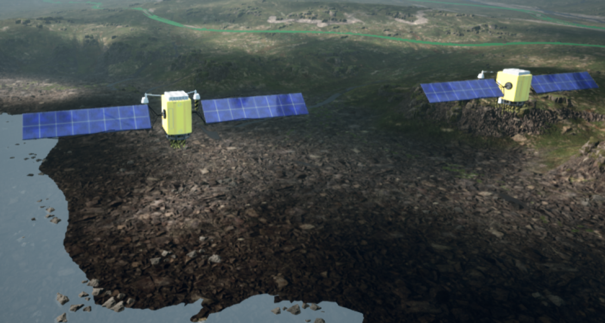
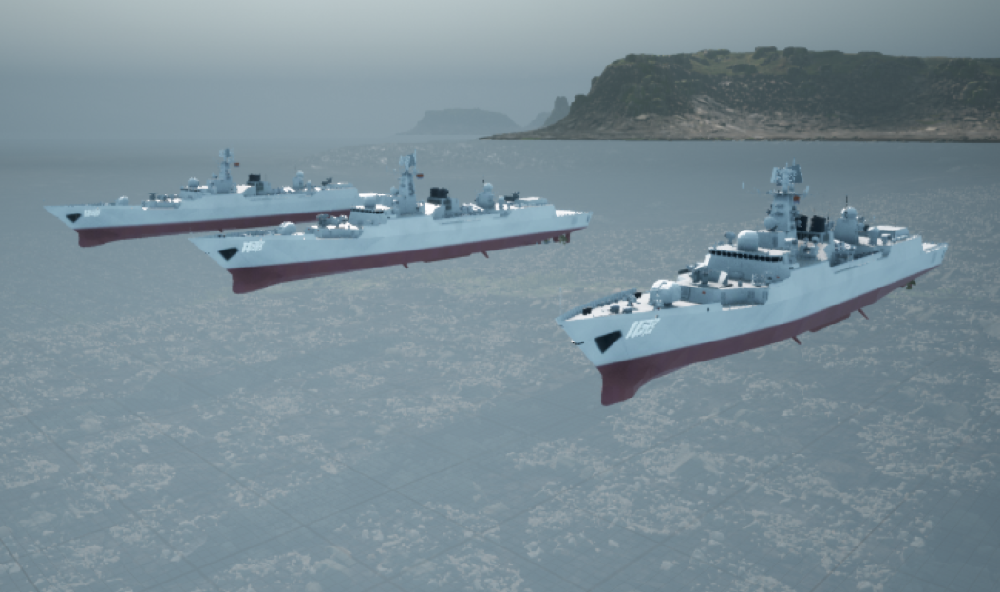

# 仿真案例

本页提供四个可复现实验入口。建议先完成异构载具实验，熟悉 `settings.json` 和 Python API，再按研究需要进行 ns-3 网络、天基任务或视觉数据采集实验。

| 实验 | 重点 | 环境 | 预计时间 |
| --- | --- | --- | --- |
| 实验一：无人机、汽车与船 | `AirGround`、载具配置、RPC 端口、Python API | Windows + UE 4.27 | 约 10 分钟 |
| 实验二：LAESim 与 ns-3 | ROS 里程计、节点映射、范围内交付、范围外丢包 | Windows + WSL2 + ROS + ns-3 | 约 15 分钟 |
| 实验三：天基任务与通信 | TLE/SGP4、多星 access、真实斜距链路、UE 显示 | Windows + 可选 WSL2/ROS/ns-3 | 约 15 分钟 |
| 实验四：GeoTIFF 下视采集 | SceneMap、覆盖航线、稳定云台、图像/GPS/ground truth | Windows + UE 4.27 | 按任务时长 |

入门示例统一维护在 [`Examples/quickstart`](https://github.com/SANIS-HITSZ/LAESim/tree/V1.5/Examples/quickstart)，包含可直接复制或生成的配置、运行脚本、预期结果和排查步骤。天基任务的完整命令和验收矩阵见[天基任务桥接](space_mission_bridge.md)与[交付检查清单](space_delivery_checklist.md)。

## 实验一：无人机、汽车与船异构仿真

### 目标

在同一个 `AirGround` 场景中创建 `UAV`、`Car`、`Boat`，使用各自的 RPC 端口同时发送控制并读取状态。该实验不需要 ROS 或 ns-3。

核心配置如下，完整文件见 [`heterogeneous_fleet/settings.json`](https://github.com/SANIS-HITSZ/LAESim/blob/V1.5/Examples/quickstart/heterogeneous_fleet/settings.json)：

```json
{
  "SimMode": "AirGround",
  "ApiServerPortCar": 41461,
  "ApiServerPortMultirotor": 41471,
  "ApiServerPortBoat": 41481,
  "Vehicles": {
    "UAV":  { "VehicleType": "SimpleFlight", "X": 0, "Y": 0,  "Z": 0 },
    "Car":  { "VehicleType": "PhysXCar",     "X": 0, "Y": -8, "Z": 0 },
    "Boat": { "VehicleType": "SimpleBoat",  "X": 0, "Y": 8,  "Z": 0 }
  }
}
```

`Vehicles` 下的键是 API 使用的实例名；`VehicleType` 选择动力学和控制接口；`X/Y/Z` 是相对于场景原点的出生位置。Boat 使用简化平面三自由度模型，不要求场景具有真实水体。

### 运行

在仓库根目录打开 PowerShell，将实验配置复制为当前 AirSim 配置：

```powershell
$AirSimDir = Join-Path ([Environment]::GetFolderPath('MyDocuments')) 'AirSim'
New-Item -ItemType Directory -Force $AirSimDir | Out-Null
$Settings = Join-Path $AirSimDir 'settings.json'
if (Test-Path $Settings) { Copy-Item $Settings "$Settings.backup" -Force }
Copy-Item .\Examples\quickstart\heterogeneous_fleet\settings.json $Settings -Force
py -3 -m pip install msgpack-rpc-python numpy opencv-contrib-python
```

先检查配置，无需启动 UE：

```powershell
py -3 .\Examples\quickstart\heterogeneous_fleet\run_experiment.py --check-only
```

看到 `configuration check passed` 后，在 UE 4.27 中打开 LAESim 场景并点击 **Play**，然后运行：

```powershell
py -3 .\Examples\quickstart\heterogeneous_fleet\run_experiment.py
```

脚本调用的关键 API 是：

```python
uav.takeoffAsync(vehicle_name="UAV").join()
uav.moveByVelocityAsync(2, 0, 0, duration, vehicle_name="UAV")
car.setCarControls(airsim.CarControls(throttle=0.55), "Car")
boat.setBoatControls(airsim.BoatControls(throttle=0.70), "Boat")
```

运行约 8 秒后，脚本停止汽车和船并让无人机降落。终端应持续显示无人机局部 NED 坐标、汽车速度、船的纵向/横向速度。

完整步骤和练习见[实验一 README](https://github.com/SANIS-HITSZ/LAESim/blob/V1.5/Examples/quickstart/heterogeneous_fleet/README.md)，完整代码见 [`run_experiment.py`](https://github.com/SANIS-HITSZ/LAESim/blob/V1.5/Examples/quickstart/heterogeneous_fleet/run_experiment.py)。

## 实验二：LAESim 节点与 ns-3 通信范围

### 目标

将 `settings.json` 中的 `UAV` 和 `Car` 自动映射为同名 ns-3 节点，通过 ROS 网络桥接器发送消息，并分别复现通信范围内全部交付和范围外全部丢包。

```text
LAESim odom_local_ned + settings X/Y/Z
                    ↓
             ROS 网络桥接器
                    ↓ POSE / SEND
         ns-3 Wi-Fi ad hoc + OLSR
                    ↓ DELIVER
          /network_sim/rx/Car
```

完整配置见 [`ns3_network/settings.json`](https://github.com/SANIS-HITSZ/LAESim/blob/V1.5/Examples/quickstart/ns3_network/settings.json)，关键部分是：

```json
{
  "Vehicles": {
    "UAV": { "VehicleType": "SimpleFlight", "X": 0,  "Y": 0, "Z": -2 },
    "Car": { "VehicleType": "PhysXCar",     "X": 20, "Y": 0, "Z": 0 }
  },
  "NetworkSimulation": {
    "Backend": "ns3",
    "Routing": "olsr",
    "MaxRangeMeters": 100.0,
    "RunnerPath": "~/opt/ns-3.48/build/scratch/ns3.48-laesim-ns3-runner"
  }
}
```

网络桥接器在启动时读取 `Vehicles`，为每个实例创建一个 ns-3 节点。AirSim 的 odometry 以各载具出生点为局部原点，因此桥接器会将配置中的 `X/Y/Z` 出生偏移加回局部里程计，再更新 ns-3 节点位置。

### 启动链路

先完成 [WSL2、ROS 与 ns-3](laesim_wsl_ros_ns3.md) 中的安装步骤，在 Windows 仓库根目录复制实验配置：

```powershell
$AirSimDir = Join-Path ([Environment]::GetFolderPath('MyDocuments')) 'AirSim'
New-Item -ItemType Directory -Force $AirSimDir | Out-Null
$Settings = Join-Path $AirSimDir 'settings.json'
if (Test-Path $Settings) { Copy-Item $Settings "$Settings.backup" -Force }
Copy-Item .\Examples\quickstart\ns3_network\settings.json $Settings -Force
```

在 UE 中点击 **Play**，随后在 WSL2 中分别启动：

```bash
# 终端 A
source /opt/ros/noetic/setup.bash
roscore
```

```bash
# 终端 B：连接 Windows LAESim
export WINDOWS_HOST="$(ip route show default | awk '{print $3}')"
source /opt/ros/noetic/setup.bash
source "${HOME}/LAESim/ros/devel/setup.bash"
roslaunch airsim_ros_pkgs airsim_node.launch host:="${WINDOWS_HOST}"
```

```bash
# 终端 C：按 settings.json 启动 ns-3 桥接器
export LAESIM_HOME="${HOME}/LAESim"
export ROS_WORKSPACE="${LAESIM_HOME}/ros"
unset BACKEND
bash "${LAESIM_HOME}/NetworkSim/scripts/run_ros_network_bridge.sh"
```

`unset BACKEND` 很重要：已存在的 `BACKEND=none` 环境变量会覆盖配置文件。

### 验证交付与丢包

当 `MaxRangeMeters` 为 `100.0` 时运行：

```bash
source /opt/ros/noetic/setup.bash
source "${HOME}/LAESim/ros/devel/setup.bash"
python3 "${HOME}/LAESim/Examples/quickstart/ns3_network/run_experiment.py" \
  --expect delivered
```

预期 `sent: 5`、`delivered: 5`、`dropped: 0`，且返回的 `simulation_time_ns` 均大于 0。V1.5 同时输出每个包的 `latency_ns`；前者是 runner 的累计仿真时刻，后者才是本包的仿真时延。

然后将 Windows 活动配置中的 `MaxRangeMeters` 改为 `5.0`，重启终端 C 的桥接器，再运行：

```bash
python3 "${HOME}/LAESim/Examples/quickstart/ns3_network/run_experiment.py" \
  --expect dropped
```

两个出生点相距约 20 米，超过 5 米硬通信范围，因此预期 `delivered: 0`、`dropped: 5`。完整步骤和排查见[实验二 README](https://github.com/SANIS-HITSZ/LAESim/blob/V1.5/Examples/quickstart/ns3_network/README.md)。

!!! note
    普通 `/airsim_node/...` 话题不会自动经过 ns-3。需要受到时延和丢包影响的业务消息应发布到 `/network_sim/tx`，接收端订阅 `/network_sim/rx/<目标载具名>`。

## 实验三：天基任务分析与通信联动

### 目标

- 使用 TLE/SGP4 或 CSV 生成卫星真实经纬高和任务时间。
- 计算多目标可见性、覆盖窗口、重访时间和最佳卫星。
- 将缩放后的卫星位置同步到 UE，同时保持真实任务几何独立。
- 可选通过 ROS/NetworkSim 验证星地 access、真实斜距链路预算、星间链路和多跳转发。

### Windows 单机验证

先启用 `how_to_use_settings/settings_space_mission_bridge.json`，进入 UE Play，然后在仓库根目录执行：

```powershell
python .\Multi_use\space_mission_bridge.py `
  --provider csv `
  --csv .\Multi_use\space_mission_sample.csv `
  --vehicle Satellite `
  --target Island:22.591164:113.975317:0 `
  --rate 2
```

该流程只需要 AirSim Python 依赖。终端应持续输出卫星真值、目标方位角/仰角/斜距和 UE 显示坐标；UE 中卫星模型的位置不用于反推真实链路距离。

离线多星任务分析不需要启动 UE：

```powershell
python .\Multi_use\space_mission_analyzer.py `
  --mission .\Multi_use\space_mission.example.json `
  --out .\Multi_use\space_mission_report `
  --print-summary
```

### ROS 与 ns-3 联动

使用 `how_to_use_settings/settings_space_dynamic_targets.json`，并按 [WSL2、ROS 与 ns-3](laesim_wsl_ros_ns3.md) 启动 ROS wrapper 和 NetworkSim。随后可运行：

```bash
cd "${HOME}/LAESim"
bash NetworkSim/scripts/run_tle_constellation_demo.sh
```

多星桥接会发布 `/space/<satellite>/state`、`/space/<satellite>/access/<target>` 和最佳星/切换状态。NetworkSim 根据 `SpaceAccessPolicy` 和真实斜距逻辑链路决定投递，并将失败阶段与原因发布到 `/network_sim/drop`。不启动这些可选脚本时，原有 UE、Python、ROS 和 `Backend=none` 流程保持不变。

## 实验四：GeoTIFF 覆盖飞行与稳定下视数据采集

### 目标

- 将带地理标签的 GeoTIFF 转换为 `NorthUp` SceneMap，并自动生成比例尺、GPS 参考和 Windows 图片路径。
- 按真实地面米规划多航带覆盖路线，使用额外稳定下视相机采集图像。
- 以固定频率关联图像、AirSim GPS、物理真值、状态估计和纳秒时间戳。
- 同时保留理想规划轨迹与实际物理轨迹，用于视觉定位、导航和地图匹配算法评估。

完整工程位于 [`Examples/quickstart/nadir_geotiff_collection`](https://github.com/SANIS-HITSZ/LAESim/tree/V1.5/Examples/quickstart/nadir_geotiff_collection)。地图和数据集通常体积较大且可能受授权限制，因此不随仓库分发；用户提供自己的 GeoTIFF。

### 准备 SceneMap

在仓库根目录运行：

```powershell
py -3 -m pip install -r .\Examples\quickstart\nadir_geotiff_collection\requirements.txt
py -3 .\Examples\quickstart\nadir_geotiff_collection\prepare_scenemap.py `
  --tif C:\data\area.tif
```

脚本生成 `scene_map.png` 和 `settings.generated.json`。后者包含 GeoTIFF 中心 `OriginGeopoint`、当地真实 `MetersPerPixel`、`GeoReference` 以及下面的稳定云台：

```json
"nadir": {
  "Pitch": -90,
  "Roll": 0,
  "Yaw": 0,
  "Gimbal": {
    "Stabilization": 1.0,
    "Pitch": -90,
    "Roll": 0,
    "Yaw": 0
  },
  "CaptureSettings": [
    { "ImageType": 0, "Width": 256, "Height": 256, "FOV_Degrees": 90 }
  ]
}
```

相机外层角度是相对机体的安装姿态；`Gimbal` 内角度是世界坐标系稳定目标。仅写前者时，无人机转弯倾斜仍会改变取景范围。

### 规划与实时采集

先在不启动 UE 的情况下检查航线：

```powershell
py -3 .\Examples\quickstart\nadir_geotiff_collection\collect_geotiff_dataset.py `
  --tif C:\data\area.tif --plan-only --overwrite
```

把 `settings.generated.json` 复制到 `%USERPROFILE%\Documents\AirSim\settings.json`，完整重启 UE 并进入 Play，然后运行：

```powershell
py -3 .\Examples\quickstart\nadir_geotiff_collection\collect_airsim_nadir.py `
  --tif C:\data\area.tif `
  --output .\Examples\quickstart\nadir_geotiff_collection\output\run01 `
  --no-land-after
```

默认参数是 1000 m、4.6 m/s、35 m 相对高度、218 s 和 10 Hz，可通过命令行覆盖。结果中的 `groundtruth.csv` 来自 `simGetGroundTruthKinematics()`；经纬度由 SceneMap 局部 NED 和 GeoTIFF 地理参考换算。`metadata.csv` 逐帧关联图像、GPS、真值、估计状态和碰撞信息，`runtime_summary.json` 用于检查采集频率和跳帧。

### 验收边界

结构检查无需 UE 和地图：

```powershell
py -3 .\Examples\quickstart\nadir_geotiff_collection\validate_example.py
```

实时验收应确认 SceneMap 加载成功、云台画面不随机体横滚/俯仰、`skipped_schedule_frame_count=0` 且实际频率接近目标。SceneMap 是平面图片，不提供真实建筑侧面、地形起伏和三维遮挡；这些任务应换用对应三维 UE 场景，但仍可复用稳定云台与采集脚本。

## 更多场景展示

以下画面来自 LAESim 当前开发场景，用于展示统一岛屿环境和多类型载具能力。

<figure class="laesim-media laesim-media--wide">
  
  <figcaption>LAESim 岛屿场景全景</figcaption>
</figure>

<figure class="laesim-media laesim-media--wide">
  
  <figcaption>空、天、地、海多类型载具的统一场景展示</figcaption>
</figure>

<div class="laesim-media-grid">
  <figure class="laesim-media">
    
    <figcaption>多无人机与多车辆空地协同</figcaption>
  </figure>
  <figure class="laesim-media">
    
    <figcaption>卫星编队场景</figcaption>
  </figure>
  <figure class="laesim-media">
    
    <figcaption>舰船编队场景</figcaption>
  </figure>
</div>

## 场景视频演示

<video class="laesim-video" controls preload="metadata" playsinline poster="../assets/showcase/laesim-air-space-sea-overview.png">
  <source src="../assets/showcase/laesim-platform-demo.mp4" type="video/mp4" />
  当前浏览器不支持 HTML5 视频播放。
</video>

视频时长约 41 秒，展示当前开发版本的岛屿环境与多类型载具运行效果。
